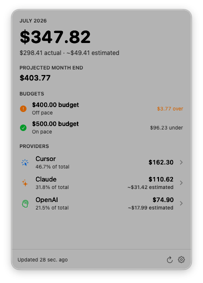
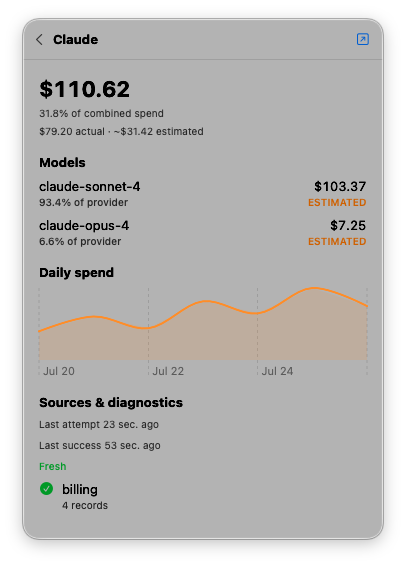

# AI Spend

AI Spend is a native, menu-bar-only macOS app that combines your current
calendar-month metered AI spend in one place. It reads supported Cursor,
Claude, Codex/OpenAI, and Fireworks sources, keeps actual and estimated charges
distinct, projects month-end spend, and warns when a budget falls off pace.

AI Spend requires macOS 14 Sonoma or later and currently displays USD only.

<p align="center">
  
  
</p>

## Highlights

- A compact menu-bar view of combined monthly spend
- Provider and model-level breakdowns
- Clear labels for provider-reported actuals and local-log estimates
- Month-end projections based on spend so far
- Budget progress bars and exhaustion forecasts based on the current burn rate
- Multiple independent monthly budgets
- Native notifications when projected spend moves off pace
- Provider-specific freshness and diagnostics
- No analytics, telemetry, or cloud service operated by AI Spend

## Download and install

Every successful push to `master` publishes a versioned
[GitHub Release](https://github.com/Asherlc/ai-spend-monitor/releases/latest)
containing the app bundle.

1. Open the latest GitHub Release.
2. Download `AISpendBar.zip`.
3. Open the archive to extract `AISpendBar.app`.
4. Drag `AISpendBar.app` into `/Applications`.
5. Control-click the app, choose **Open**, then confirm **Open**.

The CI build is ad-hoc signed but is not Developer ID signed or notarized.
Consequently, macOS may require the Control-click flow on first launch. If it
still blocks the app, open **System Settings → Privacy & Security**, verify that
the blocked item is `AISpendBar.app`, and choose **Open Anyway**.

AI Spend has no Dock icon. After launch, look for the dollar-sign icon in the
menu bar. Open its settings with the gear button at the bottom of the popover.
To remove the app, quit `AISpendBar` in Activity Monitor and move
`/Applications/AISpendBar.app` to the Trash. App data is stored separately as
described under [Privacy](#privacy).

To update, quit the running copy, download `AISpendBar.zip` from the latest
GitHub Release, and replace the existing app in `/Applications`.

## First-run setup

All four providers are enabled by default. Open **Settings → Providers** to
disable sources you do not use. A disabled provider is excluded from totals and
does not perform credential, file, browser, subprocess, or network discovery.

Claude Code and Codex can estimate supported local usage from their session
logs without an organization billing credential. Cursor can use the latest
matching dashboard usage export in `~/Downloads`. Organization billing APIs
require an appropriately scoped provider credential:

| Provider | Organization billing credential | Fallback source |
| --- | --- | --- |
| Cursor | `CURSOR_ADMIN_API_KEY` | Latest `team-usage-events-*.csv` dashboard export (actual) |
| Claude | `ANTHROPIC_ADMIN_KEY`, or `ANTHROPIC_OAUTH_TOKEN` as a fallback | Supported Claude Code logs |
| Codex/OpenAI | `OPENAI_ADMIN_KEY` | Supported Codex logs |
| Fireworks | FireConnect Keychain login, or `FIREWORKS_API_KEY` | Authenticated-user rated costs when account-wide permission is unavailable |

Ordinary CLI logins often authorize product use without granting organization
billing access. In that case, the CLI can work while actual spend remains
unavailable. AI Spend never treats an ordinary OpenAI API key as an
organization billing credential.

Only configure credentials for providers you use. Keep them out of shell
history, source control, screenshots, and support logs.

## What the total means

AI Spend counts usage-based monetary charges. It excludes fixed subscriptions,
seat fees, and usage included in a plan.

- **Actual** spend comes from provider-reported billing data.
- **Estimated** spend is reconstructed from supported local Claude Code or
  Codex logs using the bundled, versioned model-price catalog.

Actual data takes precedence over overlapping estimates. When overlap cannot be
separated safely, AI Spend excludes the ambiguous estimate instead of risking
double counting. Provider and model rows preserve the actual/estimated
distinction.

This is a monitoring aid, not an invoice or accounting export.

## Data freshness and refreshes

AI Spend refreshes:

- on launch;
- every 15 minutes while running;
- when an eligible popover opens;
- after a provider is enabled; and
- when the refresh button is clicked.

Cached data remains visible after a failed refresh and becomes stale after 30
minutes. A **Partial total** means at least one enabled provider is unavailable
or stale; it does not mean the visible provider totals are invalid.

Pacing begins after the first six elapsed hours of the month. Before then, the
app shows **Collecting pace** rather than extrapolating from too little data.

## Budgets and alerts

Open **Settings → Budgets** to add any number of distinct positive monthly
budgets, such as `$500` and `$1,500`. Every enabled budget is evaluated
independently against the same combined month-end projection.

Each budget also uses the current month-to-date burn rate to show when it is
projected to be reached. If the budget is not expected to run out before the
next calendar month, the app reports that it lasts through the month.

When a budget changes from on pace to off pace, AI Spend sends an immediate
notification. While it remains off pace, the app sends at most one reminder per
subsequent local calendar day. Alerts are suppressed when spend is unknown or
all data is stale.

macOS notification permission is requested only when the first enabled budget
is created.

## Provider behavior and limitations

### Cursor

`CURSOR_ADMIN_API_KEY` supplies actual team spend and model attribution through
Cursor's documented Admin API. Without that key, AI Spend reads the newest
`team-usage-events-*.csv` dashboard export in `~/Downloads` as an actual,
model-attributed fallback. Re-export month-to-date usage from Cursor to update
it. An existing Cursor app session can be detected for diagnostics, but Cursor
does not expose a documented app-session billing endpoint.

### Claude

`ANTHROPIC_ADMIN_KEY`, or `ANTHROPIC_OAUTH_TOKEN` when the admin key is absent,
supplies actual organization cost reports. Supported local Claude Code session
logs are scanned for uncovered estimates. Claude Enterprise browser-session
billing is not supported.

### Codex/OpenAI

`OPENAI_ADMIN_KEY` supplies actual organization cost reports. Supported local
Codex session logs are scanned for uncovered estimates. OpenAI dashboard-session
billing is not supported.

Usage-limit percentages are not converted into dollar spend.

### Fireworks

Install FireConnect with its
[official installer](https://docs.fireworks.ai/ecosystem/fireconnect/overview#install),
then run:

```bash
fireconnect login
```

AI Spend reuses that Keychain login and combines rated costs from every
Fireworks account the authenticated user can access. If an account does not
grant account-wide usage permission, AI Spend falls back to the authenticated
user's personal scope and marks the provider as partial so the limitation is
visible. Fireworks billing data may be delayed by several minutes.

Claude Code can route requests through Fireworks while also recording local
estimates. When a Claude Code log explicitly names a Fireworks model or router
resource and matching Fireworks actual usage overlaps it, AI Spend keeps the
Fireworks actual cost and excludes the Claude estimate to avoid double
counting. Plain model names and estimates without matching overlapping
Fireworks actual data remain included.

Fireworks usage billed through Microsoft Foundry/Azure is not included.

## Privacy

Spend records, budgets, alert state, and refresh metadata remain in:

```text
~/Library/Application Support/AISpendBar/
```

The **Settings → Privacy** screen can reveal the exact active data location.
Deleting the app does not automatically delete this directory.

AI Spend has no analytics or telemetry. It does not ask you to paste
credentials and does not copy credentials, browser cookies, or tokens into its
ledger. Credential and browser discovery is limited to known provider
locations, and network access is restricted to provider domains. Its
account-fingerprinting key is a random, permission-restricted file in the same
private app data directory, so routine refreshes do not require Keychain
approval. Browser discovery can be disabled globally.

Diagnostics sanitize failure descriptions. Authorization headers, cookies,
keys, query secrets, email addresses, and account identifiers are redacted.
“Admin billing scope unavailable” normally means an existing login is valid but
cannot read organization costs.

## Build from source

Install Xcode with the macOS 14 SDK or newer, clone the repository, and run:

```bash
swift build
swift test
swift format lint --recursive Sources Tests Package.swift
```

Create and verify a release app bundle:

```bash
bash Scripts/package_app.sh
bash Tests/Smoke/app_bundle_test.sh
open AISpendBar.app
```

`Scripts/package_app.sh` recreates only `AISpendBar.app` at the repository root
and ad-hoc signs it. The smoke test verifies the executable, menu-bar-only
metadata, resource bundles, decoded price catalog, packaged runtime self-check,
and code signature. The self-check exits before app initialization, provider
discovery, network work, or notification permission.

During development, quit the menu-bar-only process with Activity Monitor or:

```bash
pkill -x AISpendBar
```
